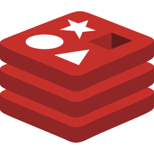

## About Me

Software Developer with 4+ years of experience.

I enjoy working on the Backend with Javascript, Go, MongoDB, and PostgreSQL.

### Languages
&ensp;
&ensp;

### Databases
&ensp;
&ensp;
&ensp;

### Technologies
&ensp;
&ensp;
&ensp;
&ensp;
&ensp;
&ensp;

### Git Status
:arrows_counterclockwise: &ensp;Commits : 

:star:&ensp;Stars : 

:hammer_and_wrench:&ensp;Pull Requests : 

:interrobang:&ensp;Issues : 

:books:&ensp;Contributions : 
