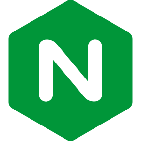

## About Me

Let's just say that I have some experience in the Software Engineering field.

Most of the time with Go (Golang), and the other time with Node.js (JavaScript, TypeScript).

### Languages
&ensp;
&ensp;
&ensp;

### Databases
&ensp;
&ensp;
&ensp;

### Technologies
&ensp;
&ensp;
&ensp;
&ensp;
&ensp;
&ensp;
&ensp;
